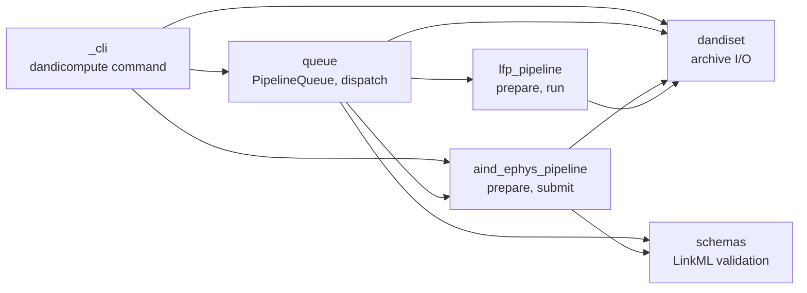

# Contributing

Thank you for your interest in contributing to DANDI Compute!

Please review:
 - Our [Code of Conduct](https://github.com/dandi-compute/dandi-compute-core?tab=coc-ov-file)
 - [AGENTS.md](../AGENTS.md), which sets the code conventions, commit rules and versioning policy for every contributor

Feel free to [open an issue](https://github.com/dandi-compute/dandi-compute-core/issues) to introduce yourself and open a discussion of places to start or things on the current TODO list!


## Development setup

```bash
git clone https://github.com/dandi-compute/dandi-compute-core
cd dandi-compute-core
pip install -e . --group dev
pre-commit install
```

Run the tests. The two LFP processing modules need the LFP scientific stack, so leave them out on the base install:

```bash
pytest tests/ \
  --ignore=tests/dandi_compute_code/lfp_pipeline/test_extract_lfp.py \
  --ignore=tests/dandi_compute_code/lfp_pipeline/test_write_nwb.py
```

To run everything, install the LFP environment too:

```bash
pip install -e . ./src/dandi_compute_code/lfp_pipeline/envs pytest
pytest tests/
```

Validate the schemas with the full LinkML toolchain, as CI does:

```bash
pip install --group schemas
DANDI_COMPUTE_REQUIRE_STRICT_SCHEMA_VALIDATION=1 pytest tests/dandi_compute_code/schemas
```

## Building the docs

See [docs/README.md](../docs/README.md).

## Package layout



| Subpackage | Responsibility |
|---|---|
| `_cli` | The `dandicompute` command. Thin Click wrappers over the public API. |
| `queue` | The queue model (`PipelineQueue`, `JobCapsule`, `JobInfo`), capsule creation across pipelines, SLURM array dispatch, reporting and archiving. |
| `aind_ephys_pipeline` | Forming AIND ephys capsules, plus their templates, parameter files, Nextflow configs and registries. |
| `lfp_pipeline` | Forming LFP capsules, and the LFP processing code that runs inside its container. |
| `dandiset` | Reading `assets.jsonld`, writing a single file into a Dandiset, moving a capsule between Dandisets, and job ID handling. |
| `schemas` | The LinkML schemas and the runtime validator. |

## Where pipeline files live

Each pipeline keeps its non-code files in subdirectories of its package, `src/dandi_compute_code/aind_ephys_pipeline/` or `src/dandi_compute_code/lfp_pipeline/`.

| Directory | Holds |
|---|---|
| `templates/` | The Jinja2 submission script template, `submission_template.txt` |
| `params/` | Parameter files, named `name-{id}.json`. The LFP pipeline also keeps `parameter_schema.json` here, the hand-written JSON Schema its parameters are validated against. |
| `configs/` | Nextflow configs for a compute environment, named `name-{environment}_revision-{n}.config` (AIND only) |
| `registries/` | The registries mapping short keys to those files and their MD5 checksums |

The LFP pipeline's scientific dependencies (SpikeInterface, neuroconv, pynwb) are kept out of the base install. They are declared in `src/dandi_compute_code/lfp_pipeline/envs/pyproject.toml` and baked into the container built from `src/dandi_compute_code/lfp_pipeline/containers/lfp.Dockerfile`, which the manually dispatched `Build and upload LFP container image` workflow pushes to the GitHub Container Registry.

## Adding a parameter set

1. Add the file to the pipeline's `params/` directory, named `name-{id}.json`. For AIND, include a `pipeline_version` field naming the release it was written for.
2. Register it in that pipeline's `registries/registered_params.json`:

   ```json
   "my-params": {
     "path": "name-my+params.json",
     "md5": "<output of md5sum on the file>",
     "description": "What it is for and how it differs from the others."
   }
   ```

3. To have the queue form capsules with it automatically, add the key to the pipeline's `params` list in `src/dandi_compute_code/queue/pipeline_configs.json`. Otherwise it is only used when passed explicitly with `--params`.

LFP parameter files must also satisfy `lfp_pipeline/params/parameter_schema.json`.

Never edit a registered file in place to change what it does. Add a new file under a new key and, if it should become the recommendation, re-point `default` at it. Existing capsules keep pointing at the old file's checksum.

## Adding a Nextflow config

1. Add `name-{environment}_revision-{n}.config` to `aind_ephys_pipeline/configs/`.
2. Register it in `aind_ephys_pipeline/registries/registered_configs.json` with its path and MD5.
3. Select it with `--config {key}`, or re-point `default` at it.

## Changing dispatch limits

Edit the pipeline's `dispatch` block in `pipeline_configs.json`. Only `max_concurrent` and `max_array_tasks` are configurable. Resource requests come from each capsule's own `submit.sh`, so change them in the pipeline's submission template. See [docs/dispatch.md](../docs/dispatch.md).

## Adding a pipeline

The queue is pipeline agnostic, and everything that differs per pipeline is reached through four hooks on `dandi_compute_code.queue.PipelineQueue`.

| Hook | Returns |
|---|---|
| `_resolve_latest_pipeline_version` | The version new capsules target |
| `_resolve_config_key_to_id` | The config ID recorded for a config key |
| `_fetch_qualifying_content_ids` | The content IDs of every asset the pipeline should run on |
| `_prepare_job` | Forms one capsule and returns its `submit.sh` path, or `None` when one already exists |

The base class serves any pipeline no subclass claims, which is how `lfp` works. A pipeline that needs its own behaviour subclasses `PipelineQueue` and names itself in `pipelines`, as `AindEphysPipelineQueue` does for `aind+ephys`. The subclass must be imported by `queue/__init__.py` for `PipelineQueue.for_pipeline` to find it.

A new pipeline also needs:

- a subpackage with a `prepare_*_job` function that follows the capsule layout and writes the `DandiCompute` provenance block (see [docs/job_capsules.md](../docs/job_capsules.md))
- a submission template whose `#SBATCH` header states the resources the capsule needs, and whose `--output` points into the capsule's `logs/`
- an entry for that template in `_PIPELINE_TEMPLATE_FILE_PATHS` in `queue/_dispatch_config.py`
- its registries, added to `_PARAMS_REGISTRIES` and, if it has configs, `_CONFIGS_REGISTRIES` in `queue/_globals.py`
- an entry in `pipeline_configs.json`

## Adding a schema

See [docs/internal/schemas.md](../docs/internal/schemas.md).
