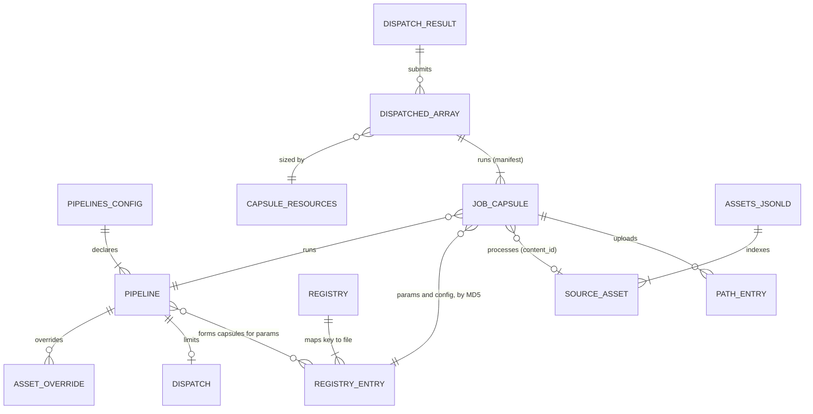
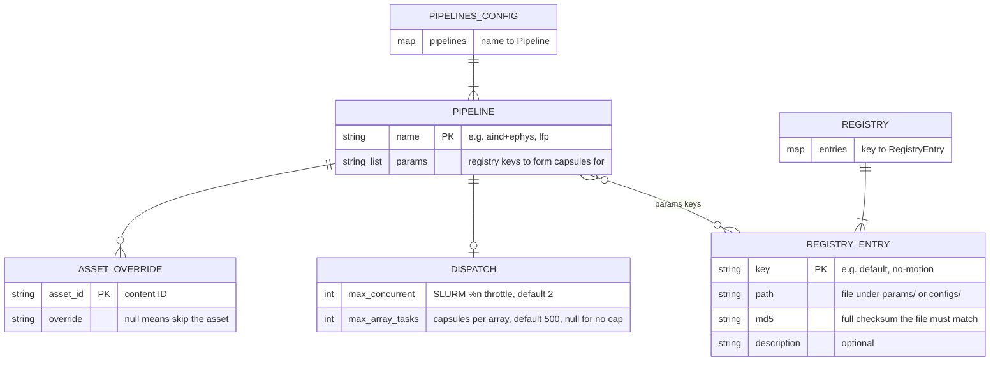
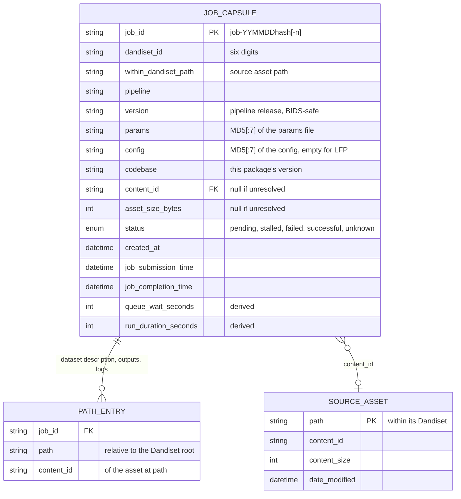
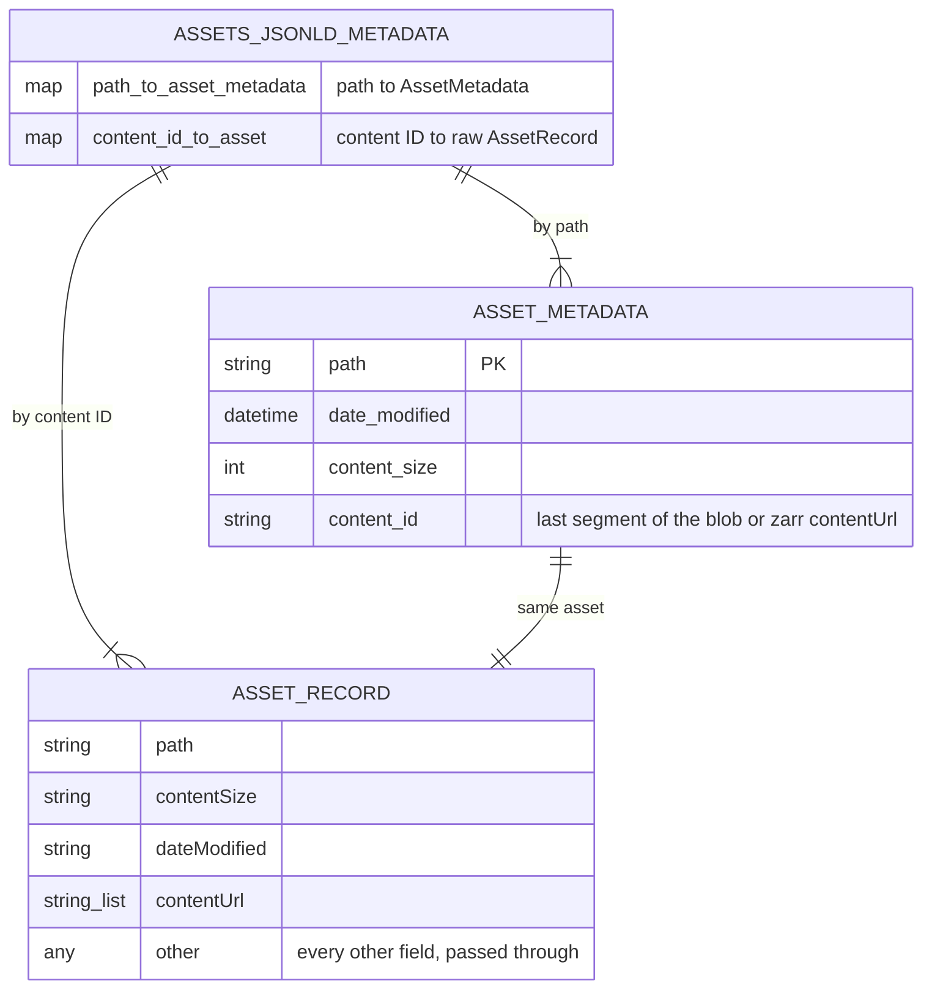
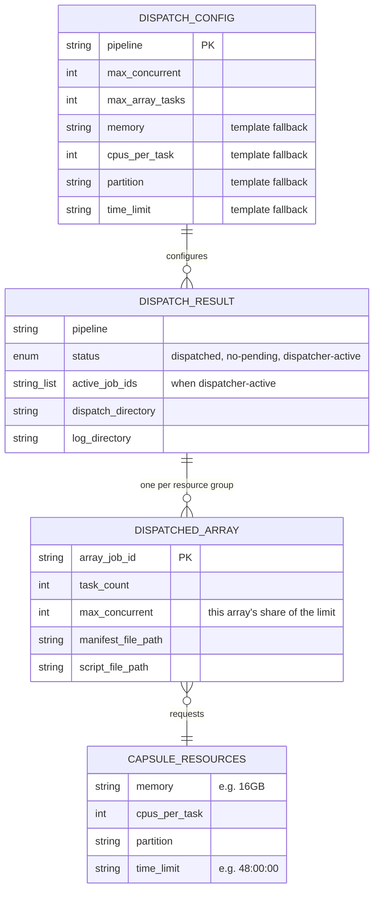

# Data model

This page maps the structures the package reads, writes and passes around, and how they relate. The authoritative definitions are the LinkML schemas under `src/dandi_compute_code/schemas/`. The diagrams here follow them field for field.

## How it fits together



Read it in three layers.

- **Configuration** is packaged with the code. `pipeline_configs.json` names the pipelines and their parameter sets, and each pipeline's registries pin those names to checksummed files.
- **Job state** lives on the archive. Each capsule is a `jobs.tsv` row and a set of `paths.tsv` rows, rebuilt from `assets.jsonld` on demand.
- **Dispatch records** are produced by `queue process` and kept under the base directory's `processing/derivatives/logs/`.

## Configuration



`asset_overrides` is validated when the configuration loads, but capsule formation does not consult it yet. An asset listed there with a null override is still processed.

The registries in use are:

| Registry file | Maps keys to | Used by |
|---|---|---|
| `aind_ephys_pipeline/registries/registered_params.json` | `aind_ephys_pipeline/params/*.json` | `--params`, `pipeline_configs.json` |
| `aind_ephys_pipeline/registries/registered_configs.json` | `aind_ephys_pipeline/configs/*.config` | `--config` |
| `lfp_pipeline/registries/registered_params.json` | `lfp_pipeline/params/*.json` | `pipeline_configs.json`, `python -m dandi_compute_code.lfp_pipeline --params` |

Several keys may point at one file, which is how `default` tracks the current recommendation while versioned keys such as `deterministic-v1.2.4` stay fixed. Because a capsule records the file's MD5 prefix rather than its key, re-pointing `default` at a new file forms new capsules, while adding an alias for an existing file does not.

## Job state



`JOB_CAPSULE` is one row of `derivatives/jobs.tsv`, in the column order shown. In code it is a {class}`~dandi_compute_code.queue.JobCapsule` wrapping the immutable identity fields of a {class}`~dandi_compute_code.queue.JobInfo`, and a {class}`~dandi_compute_code.queue.PipelineQueue` is the list of them.

`PATH_ENTRY` is one row of `derivatives/paths.tsv`. Paths are kept out of `jobs.tsv` so that table stays narrow enough to browse. Where a path sits beneath the capsule says what it is:

| Path under the capsule | Held in the `JobCapsule` field |
|---|---|
| `dataset_description.json` | `dataset_description_path` |
| `derivatives/...` | `output_paths` |
| `logs/...` | `log_paths` |

Each table is accompanied by a BIDS-style JSON sidecar, `derivatives/jobs.json` and `derivatives/paths.json`. The sidecar gives every column its `Description`, read from the job capsule LinkML schema. It also lists the permissible `status` values as `Levels` and the `Units` of the size and duration columns.

`content_id` and `asset_size_bytes` describe the *source* asset. They are looked up in the source Dandiset's own `assets.jsonld` by `within_dandiset_path`, and left null with a warning when that path no longer exists there.

### Example rows

`jobs.tsv`:

```text
job_id              dandiset_id  within_dandiset_path                  pipeline    version  params   config   codebase  content_id                            asset_size_bytes  status      created_at            job_submission_time   job_completion_time   queue_wait_seconds  run_duration_seconds
job-260916a1b2c3    000409       sub-mouse01/sub-mouse01_ecephys.nwb   aind+ephys  v1.2.4   4e89ec7  7940dfd  v0.8.2    048d1ee9-83b7-491f-8f02-1ca615b1d455  1073741824        successful  2026-09-16T10:02:11Z  2026-09-16T10:15:40Z  2026-09-16T14:48:02Z  809                 16342
```

`paths.tsv`:

```text
job_id              path                                                                          content_id
job-260916a1b2c3    derivatives/dandisets-000/dandiset-000409/.../job-260916a1b2c3/dataset_description.json   <content id>
job-260916a1b2c3    derivatives/dandisets-000/dandiset-000409/.../job-260916a1b2c3/derivatives/nwb/...        <content id>
job-260916a1b2c3    derivatives/dandisets-000/dandiset-000409/.../job-260916a1b2c3/logs/nextflow.log          <content id>
```

## The archive index

Every query about job state starts from a Dandiset's `assets.jsonld`, fetched from `https://dandiarchive.s3.amazonaws.com/dandisets/{dandiset_id}/draft/assets.jsonld`. It is indexed two ways, since the queue looks assets up both by where they live and by what they contain.



The raw records are kept whole so that callers can reach a field the index does not model. For example, reading a capsule's `submit.sh` or `dataset_description.json` back uses the record's `contentUrl`, with no download of the Dandiset.

## Dispatch records



`DispatchConfig` extends `CapsuleResources`. Its resource fields are read from the pipeline's packaged submission template, and only apply to a capsule whose own `submit.sh` cannot be read back. [Array dispatch](dispatch.md) covers how capsules are grouped and how the limit is shared across arrays.

## Reports uploaded to the archive

Besides the two tables, three JSON reports are written into `001697`'s `derivatives/`. Each is rebuilt from scratch when its command runs.

`queue_stats.json`, from `dandicompute queue stats`:

```json
{
  "generated_at": "2026-09-23T03:00:12+00:00",
  "state_entry_count": 1834,
  "successful_asset_bytes_total": 51234567890,
  "timeline_files_processed": 902,
  "job_step_wall_time_seconds": {
    "curation": 10234.5,
    "postprocessing": 90123.0,
    "spikesort_kilosort4": 450012.2
  }
}
```

`job_step_wall_time_seconds` sums the durations from every capsule's Nextflow `logs/timeline.html`, keyed by process name.

`issues_dump.json`, from `dandicompute issues dump`:

```json
{
  "generated_at": "2026-09-23T03:05:40+00:00",
  "capsule_count": 1,
  "records": [
    {
      "capsule_path": "derivatives/dandisets-000/dandiset-000409/.../job-260916a1b2c3",
      "nextflow_log": "derivatives/.../job-260916a1b2c3/logs/nextflow.log",
      "nextflow_errors": ["ERROR ~ Error executing process > 'spikesort_kilosort4 (1)'"],
      "slurm_errors": {"job-900_slurm.log": ["slurmstepd: error: Detected 1 oom_kill event"]}
    }
  ]
}
```

An error line is any non-empty line of `logs/nextflow.log` or `logs/*slurm.log` that contains `error`, in any case. Only capsules with at least one are listed.

`issues_summary.json`, from `dandicompute issues summarize`, groups every distinct error line by how often it occurs, most frequent first:

```json
{
  "generated_at": "2026-09-23T03:05:44+00:00",
  "summary": {
    "37": ["slurmstepd: error: Detected 1 oom_kill event"],
    "4": ["ERROR ~ Error executing process > 'spikesort_kilosort4 (1)'"]
  }
}
```
