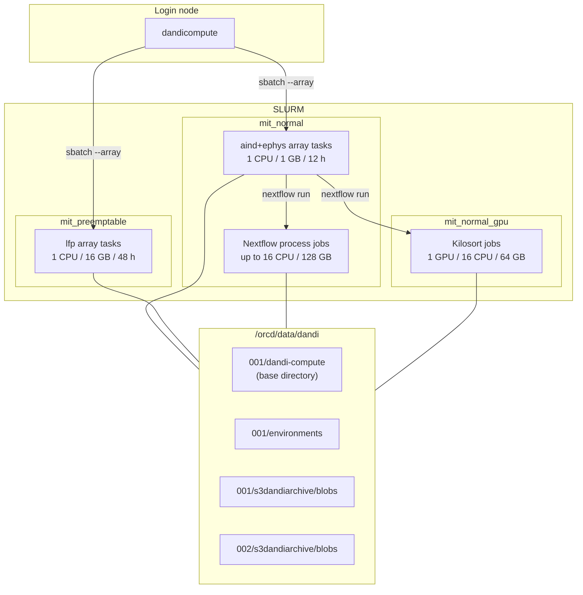

# Infrastructure

DANDI Compute runs on [MIT Engaging](https://orcd-docs.mit.edu), the MIT Office of Research Computing and Data's SLURM cluster. This page describes what it depends on there and elsewhere, and where each piece lives.

## Where things run



The login node only prepares and submits. Everything heavy runs as SLURM jobs, and every job reads its input from the cluster's local mirror of the archive's blobs rather than downloading it.

## The base directory

Every command takes `--base`, defaulting to `/orcd/data/dandi/001/dandi-compute`. Its layout is fixed.

```text
/orcd/data/dandi/001/dandi-compute/
├── code/                        # checkout of this repository, installed with pip -e
├── aind-ephys-pipeline/         # checkout of the AIND ephys pipeline, tags checked out per job
├── work/                        # Nextflow work directory
│   └── apptainer_cache/         # container images, kept by `clean --work`
└── processing/
    ├── prepare-job-XXXXXXXX/    # one preparation tree per capsule (see below)
    │   └── 001697/
    │       ├── dandiset.yaml
    │       └── derivatives/.../job-{id}/
    ├── move-capsule-XXXXXXXX/   # temporary, while `archive` moves a capsule
    ├── dandicompute-dispatch-{pipeline}-{YYYYMMDD-HHMMSS}/   # one per dispatch
    │   └── task-{array job}-{task}/
    ├── derivatives/logs/dandicompute-dispatch-{pipeline}/   # manifests, scripts, array logs
    └── done.txt                 # preparation trees whose script ran to completion
```

| Path | Written by | Removed by |
|---|---|---|
| `code/` | Kept up to date by hand with `git pull` | Never |
| `aind-ephys-pipeline/` | Kept up to date by hand. Each AIND job runs `git checkout {version}` in it before starting. | Never |
| `work/` | Nextflow | `dandicompute clean --work` |
| `processing/prepare-job-*` | `prepare aind`, `jobs create` | Nothing automatic |
| `processing/dandicompute-dispatch-*` | `queue process` | `dandicompute clean --dispatch`, once no dispatcher is live and the directory is old enough |
| `processing/derivatives/logs/` | `queue process` and its array tasks | Never. It is the permanent dispatch record. |
| temporary trees from `queue refresh`, `queue stats`, `issues`, `archive` | Those commands | The same command on success. Kept with `--test`, or when a step fails. |

:::{important}
A capsule's `submit.sh` runs against its **preparation tree**, by absolute path. The pipeline writes its intermediate results, logs and outputs there, and AIND's closing `dandi upload` uploads from there. The copy of `code/` an array task downloads is used only to claim the capsule and read the script. A preparation tree must therefore stay in place until its capsule has run.
:::

Because the AIND submission script checks out a tag in the shared `aind-ephys-pipeline/` checkout, two AIND capsules targeting different pipeline versions should not start at the same moment. In practice every new capsule targets the latest tag, so they agree.

## Software on the cluster

| Component | Where | Used for |
|---|---|---|
| Environment modules | `/etc/profile.d/modules.sh` | Loading `miniforge` and `apptainer` in every submission script |
| Conda environment `name-nextflow_environment` | `/orcd/data/dandi/001/environments/` | Nextflow and the DANDI CLI for AIND capsules |
| Conda environment `name-lfp_environment` | `/orcd/data/dandi/001/environments/` | DataLad, `datalad-container` and `duct` for LFP capsules |
| Apptainer | module | Running every pipeline container |
| DANDI CLI | the environment running `dandicompute`, and each pipeline environment | Every download, upload and delete against the archive. AIND capsules upgrade it with `pip install -U dandi` before uploading. |
| `sbatch`, `squeue` | SLURM | Submitting arrays, detecting live dispatchers |

The AIND ephys pipeline also needs `NUMBA_CACHE_DIR` to be set in `~/.bashrc` to the same value as the Nextflow work directory. Its Nextflow config passes `KACHERY_ZONE`, `KACHERY_API_KEY`, `NUMBA_CACHE_DIR`, `HDF5_USE_FILE_LOCKING` and `HF_HOME` through to the containers when they are set.

### AIND ephys execution

Each AIND capsule's `submit.sh` is a small driver. It activates the Nextflow environment, checks out the capsule's pipeline version, and runs `main_multi_backend.nf` with the capsule's `.config` and parameter file. Nextflow then submits each pipeline step as its own SLURM job using the resources in the registered config.

| Nextflow process | CPUs | Memory | Partition |
|---|---|---|---|
| `job_dispatch` | 4 | 32 GB | `mit_normal` |
| `preprocessing` | 16 | 128 GB | `mit_normal` |
| `spikesort_kilosort4`, `spikesort_kilosort25` | 16 + 1 GPU | 64 GB | `mit_normal_gpu` |
| `spikesort_spykingcircus2` | 16 | 64 GB | `mit_normal` |
| `postprocessing` | 16 | 64 GB | `mit_normal` |

These figures come from `configs/name-mit+engaging_revision-2.config`, which the `default` config key points to. Time limits follow the partition maximums, 12 hours on `mit_normal` and 6 hours on the GPU partition.

When Nextflow finishes, the script moves the results out of `intermediate/` into the capsule's `derivatives/`, moves Nextflow's reports into `logs/`, deletes `intermediate/` and uploads the capsule.

### LFP execution

Each LFP capsule's `submit.sh` registers the `dandi-compute-lfp` image with DataLad (once per dataset), then runs `python -m dandi_compute_code.lfp_pipeline` inside it through `datalad containers-run`, wrapped in `duct` to record resource usage into `logs/`. The container image tag is the version of this package that prepared the capsule.

## The LFP container

| Property | Value |
|---|---|
| Image | `ghcr.io/dandi-compute/dandi-compute-lfp:{version}` |
| Dockerfile | `src/dandi_compute_code/lfp_pipeline/containers/lfp.Dockerfile` |
| Base | `neurodebian:trixie` |
| Contents | This package plus `src/dandi_compute_code/lfp_pipeline/envs`, in a virtual environment at `/opt/venv` |
| Built by | The manually dispatched `Build and upload LFP container image` workflow |

Since the image tag follows the package version, the container has to be rebuilt and pushed for each release that LFP capsules will be prepared against.

## Reading input data

Capsules never download their input. The cluster keeps a mirror of the archive's S3 blobs, and a capsule's script points straight at the blob by content ID:

```text
/orcd/data/dandi/{partition}/s3dandiarchive/blobs/{id[0:3]}/{id[3:6]}/{content_id}
```

`{partition}` is `001` for content IDs starting with `0` to `8`, and `002` otherwise. Only blob assets are supported. Zarr assets cannot be processed yet.

## External services

| Service | Address | Used for |
|---|---|---|
| DANDI Archive API | `dandiarchive.org` | Uploading, downloading, deleting and moving capsules, through the DANDI CLI and its Python client |
| DANDI S3 bucket | `dandiarchive.s3.amazonaws.com/dandisets/{id}/draft/assets.jsonld` | The full asset listing of a Dandiset, read by every queue command |
| `dandi-cache/qualifying-aind-content-ids` | GitHub raw, `qualifying_aind_content_ids.jsonl.gz` | Which assets qualify for `aind+ephys` |
| `dandi-cache/qualifying-lfp-content-ids` | GitHub raw, `qualifying_lfp_content_ids.jsonl` | Which assets qualify for `lfp`. A looser superset of the AIND list. |
| `dandi-cache/content-id-to-usage-dandiset-path` | GitHub raw, `content_id_to_usage_dandiset_path.jsonl` | Resolving a content ID to the Dandiset and path it is used at |
| GitHub Container Registry | `ghcr.io/dandi-compute` | The LFP container image |

The login node therefore needs outbound HTTPS to GitHub and to the DANDI Archive and its bucket. The compute nodes need the DANDI Archive, and GHCR for LFP capsules.

## Dandisets

| Dandiset | Contents |
|---|---|
| `001697` | Every live job capsule, `jobs.tsv`, `paths.tsv` and the queue reports |
| `001873` | Archived capsules and their own `jobs.tsv` and `paths.tsv` |

Both are written as draft Dandisets with `dandi upload --allow-any-path`, since capsule paths do not follow the layouts DANDI validates. The account behind `DANDI_API_KEY` needs owner rights on both.

## Continuous integration

| Workflow | Runs on | What it does |
|---|---|---|
| `Deploy tests` | Pull requests, merge queue | The test suite on Ubuntu with Python 3.13, plus a job with the LFP scientific stack installed |
| `Daily tests` | Every day at 12:00 UTC | The test suite on Python 3.11 to 3.14 and schema validation, with an email on failure |
| `Validate LinkML schemas` | Pull requests, merge queue, daily | Compiles every schema and validates every packaged data file against it with the full LinkML toolchain |
| `Build documentation` | Pull requests, pushes to `main` | Builds these docs with warnings as errors |
| `Version Check` | Pull requests touching `src/` or `pyproject.toml` | Fails unless the package version was bumped |
| `Build and upload LFP container image` | Manual | Builds and pushes the LFP container to GHCR |

The documentation is hosted on Read the Docs from `.readthedocs.yaml`.
