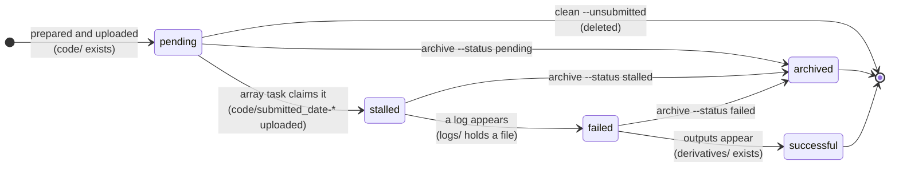
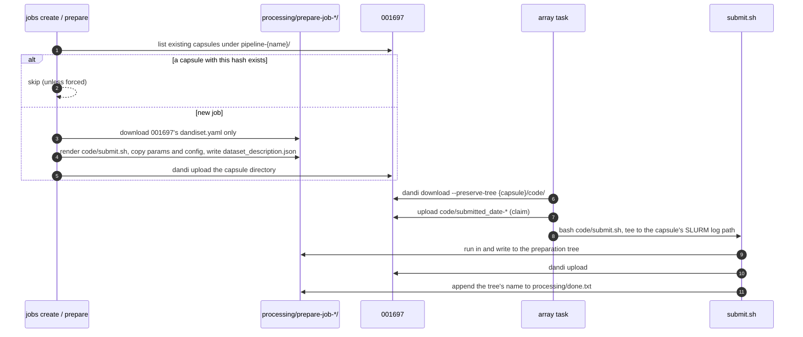

# Job capsules

A job capsule is one run of one pipeline over one asset with one parameter set. It is a directory uploaded to the job capsules Dandiset (`001697`), and it holds everything needed to run, inspect and account for that run.

## Where a capsule lives

```text
derivatives/
├── jobs.tsv                           # one row per capsule (see Data model)
├── jobs.json                          # BIDS-style sidecar describing the jobs.tsv columns
├── paths.tsv                          # one row per asset path of each capsule
├── paths.json                         # BIDS-style sidecar describing the paths.tsv columns
├── issues_dump.json
├── issues_summary.json
└── dandisets-{first 3 digits}/
    └── dandiset-{dandiset_id}/
        └── {path of the asset, without .nwb}/
            └── pipeline-{pipeline}/
                └── job-{YYMMDD}{hash}/        # the capsule
                    ├── dataset_description.json
                    ├── code/
                    │   ├── submit.sh
                    │   ├── {parameters}.json
                    │   ├── submitted_date-YYYY+MM+DD_time-HH+MM+SS   # added when claimed
                    │   └── ...                                       # pipeline specific
                    ├── logs/
                    └── derivatives/                                  # added on success
```

For example, the capsule for `sub-mouse01/sub-mouse01_ecephys.nwb` in Dandiset `000409` might be:

```text
derivatives/dandisets-000/dandiset-000409/sub-mouse01/sub-mouse01_ecephys/pipeline-aind+ephys/job-260916a1b2c3/
```

The `dandisets-{first 3 digits}` level keeps any one directory from holding thousands of Dandisets.

### What each pipeline puts in a capsule

| Path | `aind+ephys` | `lfp` |
|---|---|---|
| `code/submit.sh` | Nextflow driver script | `datalad containers-run` script |
| `code/{parameters}.json` | The registered AIND parameter file | The registered LFP parameter file |
| `code/{config}.config` | The registered Nextflow config | Not used |
| `code/main_multi_backend.nf` | Copy of the pipeline entry point | Not used |
| `code/capsule_versions.env` | Copy of the pipeline's pinned capsule versions | Not used |
| `logs/` | `nextflow.log`, `job-{id}_slurm.log`, Nextflow reports such as `timeline.html` | `duct_*` resource usage, `job-{id}_slurm.log` |
| outputs | `derivatives/nwb/`, `derivatives/visualization/`, `derivatives/postprocessed/` | `derivatives/nwb/{asset}_desc-lfp` |

## The job ID

The directory name is the job ID, `job-{YYMMDD}{hash}`.

- `YYMMDD` is the UTC date the capsule was prepared. It makes the name readable and separates re-attempts of one job across days.
- `hash` is the first six hex characters of an MD5 over the fields that identify the job. Those are the Dandiset ID, the asset's path and content ID, the pipeline and its version, and the parameters and config IDs.

For example:

| Job ID | What it is |
|---|---|
| `job-260916a1b2c3` | A job first prepared on 16 September 2026 |
| `job-260920a1b2c3` | The same job prepared again on 20 September, after the first capsule was archived |
| `job-260916a1b2c3-2` | The same job prepared a second time on 16 September |
| `job-2609167f04d9` | A different job prepared the same day, for example the same asset with other parameters |

The codebase version is left out on purpose. A job is the same logical job whichever release of this package formed it. That is how the queue decides a capsule already exists and must not be formed again.

Parameters and configs enter the hash by the MD5 of their contents rather than by their registry key. Two keys pointing at the same file therefore form the same job, and editing a file (and its registered checksum) forms a new one.

Two capsules can still share an ID when the same job is formed twice on the same day, for example by `jobs create --latest`. The second carries a `-2` suffix, the third `-3`, and so on. The queue reads through the suffix, so every spelling is recognised as the same job.

This job ID is the only capsule layout the package understands. Capsules prepared before it existed carry older names, and the queue does not see them until they are migrated.

## Provenance

The job ID alone does not say what was run. That is recorded in the capsule's `dataset_description.json`, under a `DandiCompute` key next to the standard BIDS fields.

```json
{
  "Name": "DANDI Compute: AIND Ephys pipeline output for Dandiset 000409",
  "BIDSVersion": "1.10",
  "DatasetType": "study",
  "GeneratedBy": [
    {"Name": "AIND Ephys Pipeline", "Version": "v1.2.4+<pipeline commit>", "CodeURL": "..."},
    {"Name": "DANDI Compute: Code", "Version": "v0.8.2+<codebase commit>", "CodeURL": "..."}
  ],
  "SourceDatasets": [{"URL": "https://dandiarchive.org/dandiset/000409/"}],
  "DandiCompute": {
    "job_id": "job-260916a1b2c3",
    "dandiset_id": "000409",
    "within_dandiset_path": "sub-mouse01/sub-mouse01_ecephys.nwb",
    "content_id": "048d1ee9-83b7-491f-8f02-1ca615b1d455",
    "pipeline": "aind+ephys",
    "version": "v1.2.4",
    "codebase": "v0.8.2",
    "params": "4e89ec7",
    "config": "7940dfd",
    "params_key": "default",
    "config_key": "default"
  }
}
```

`jobs refresh` reads this block back for every capsule to build `jobs.tsv`. Pipeline versions are written "BIDS-safe", with `-` replaced by `+`, so `v1.0.0-fixes` is recorded as `v1.0.0+fixes`.

## Lifecycle

A capsule's status is not stored anywhere. It is derived each time the queue is read, from which of its files exist on the archive. The checks run from the furthest point in the lifecycle backwards, so every capsule lands on exactly one status.



| Status | Observed on the archive | Meaning |
|---|---|---|
| `pending` | `code/` but no submitted marker | Formed and waiting for a dispatcher. |
| `stalled` | A `code/submitted*` marker, but no logs | Claimed by an array task, with no logs uploaded yet. Logs are uploaded when a run finishes, so a capsule sits here for its whole run. It also stays here if its task died before uploading anything. An AIND run cut short by its time limit, preemption or `scancel` uploads its logs first, so it moves on to `failed`. |
| `failed` | Logs, but no `derivatives/` | Logs were uploaded without outputs. A run that uploads its logs part way through reads the same, and nothing on the archive tells the two apart, so they share one status. |
| `successful` | `derivatives/` | Outputs were uploaded. |
| `unknown` | None of the above | Also the fallback for a status cell in `jobs.tsv` that is empty or unrecognised. |

`archived` is not a status. An archived capsule has moved to `001873`, where it keeps whichever status it had.

### Timestamps

`jobs.tsv` records three timestamps, each read from the `dateModified` of an asset on the archive.

| Column | Taken from |
|---|---|
| `created_at` | `code/submit.sh` |
| `job_submission_time` | The earliest `code/submitted*` marker. A resubmitted capsule can carry several. |
| `job_completion_time` | The latest file under `logs/` |

`queue_wait_seconds` and `run_duration_seconds` are the differences between consecutive pairs. They are derived when the table is written and ignored when it is read back.

`process_wall_time_seconds` sums the duration of every process in the capsule's Nextflow `logs/timeline.html`. `jobs refresh` downloads each report to fill it in, and leaves it empty for a capsule with no readable report.

## From preparation to results



The submission script refers to the preparation tree by absolute path. That tree, `processing/prepare-job-*/001697/{capsule}/`, is where the pipeline writes its intermediate results, logs and outputs, and where its closing `dandi upload` uploads them from. The copy an array task downloads is used only to read `submit.sh` and to claim the capsule. Preparation trees therefore have to outlive the capsule's run, and nothing removes them automatically. `processing/done.txt` lists the ones whose script ran to completion.

## Curating a successful run

A successful `aind+ephys` capsule holds one SortingAnalyzer per recorded stream, under `derivatives/postprocessed/`. Each is a Zarr asset, so [SpikeInterface GUI](https://github.com/SpikeInterface/spikeinterface-gui) can open it straight from the archive's public S3 bucket. Nothing is downloaded up front. The GUI fetches only what each view needs.

### Generate the script

`dandicompute curate` looks up the capsule's Zarr IDs and prints a ready-to-run script. Pass the job ID, or the capsule's path relative to the Dandiset root when a job ID is ambiguous.

```bash
dandicompute curate --job job-260612eac7ed > curate.py
```

The command needs no API key, as it reads the job capsules Dandiset's public `assets.jsonld`. It fails when the capsule has no postprocessed outputs, which is the case for every capsule that is not `successful`.

### What the script does

For `job-260612eac7ed` the body of the script comes out as follows.

```python
import json
import pathlib

import spikeinterface
import spikeinterface_gui

ANALYZERS = {
    "block0_acquisition-ElectricalSeriesRaw_recording1": "s3://dandiarchive/zarr/cc0f0a1e-f69e-489c-8501-255c20f83068/",
}
STREAM = "block0_acquisition-ElectricalSeriesRaw_recording1"
CURATION_FILE = pathlib.Path(f"job-260612eac7ed_{STREAM}_curation.json")


def save_curation(curation_data: dict) -> None:
    CURATION_FILE.write_text(json.dumps(curation_data, indent=4, default=str))
    print(f"Saved curation to {CURATION_FILE.absolute()}")


analyzer = spikeinterface.load_sorting_analyzer(ANALYZERS[STREAM], load_extensions=False)

# The GUI would otherwise read and write its curation inside the analyzer, which is read-only on the archive.
if CURATION_FILE.exists():
    curation_dict = json.loads(CURATION_FILE.read_text())
else:
    curation_dict = {"format_version": "2", "unit_ids": analyzer.unit_ids.tolist()}

spikeinterface_gui.run_mainwindow(
    analyzer,
    mode="web",
    curation=True,
    curation_dict=curation_dict,
    curation_callback=save_curation,
    skip_extensions=["waveforms", "principal_components"],
)
```

- `ANALYZERS` maps each stream to the S3 URL of its Zarr asset, `s3://dandiarchive/zarr/{zarr ID}/`. The Zarr ID is the last segment of the asset's `contentUrl`, not its asset ID. A capsule with several probes lists one entry per probe, and `STREAM` picks which one to curate.
- `load_sorting_analyzer` falls back to anonymous S3 access on its own, so no AWS credentials are needed.
- Curation is kept in a local JSON file beside the script. **Save curation** in the curation view writes it, and the next launch picks up where the last one left off. The GUI's usual **Save in analyzer** cannot work here, because the analyzer on the archive is read-only.
- `waveforms` and `principal_components` are the largest extensions, so they are skipped to keep start-up fast. The waveform heatmap and the PC scatter view are hidden as a result. Remove them from `skip_extensions` to bring those views back.
- The analyzer has no recording attached, because it pointed at the NWB file on the compute cluster. The trace views are hidden as well.

### Run it

```bash
pip install "spikeinterface-gui[web]" s3fs
python curate.py
```

The GUI opens in a browser tab. Loading the extensions takes around half a minute on a typical connection. For the desktop app instead, install `spikeinterface-gui[desktop]` and change `mode="web"` to `mode="desktop"`.

The saved JSON follows SpikeInterface's curation format. Pass it to `spikeinterface.curation.apply_curation`, together with the analyzer or its sorting, to get the curated units.

## Formation rules

- A capsule is never formed twice. Before preparing, the code lists existing capsules under the asset's `pipeline-{name}/` directory in `001697` and stops if one has the same hash, whatever its date or status.
- `jobs create` additionally skips any asset whose `(pipeline, params, config, content_id)` already has a capsule of any pipeline version. New pipeline versions are only rolled out with `--latest`.
- New capsules always target the latest version available on the machine. For `aind+ephys` that is the highest `vX.Y.Z` tag in the local pipeline checkout. For `lfp` it is this package's own version, which also picks the container tag.
- An AIND parameter file declares the pipeline version it was written for. Preparation refuses a requested version in a different major series, or one older than the file's.
- An asset whose content ID is missing from the `content-id-to-usage-dandiset-path` cache is skipped with a warning. When a content ID is used at several paths, the first one listed is used.
