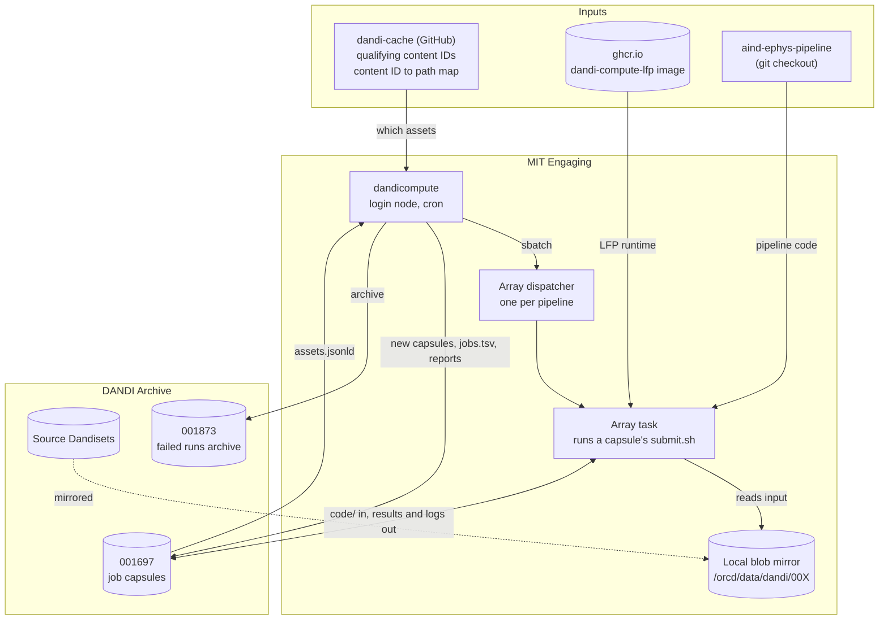
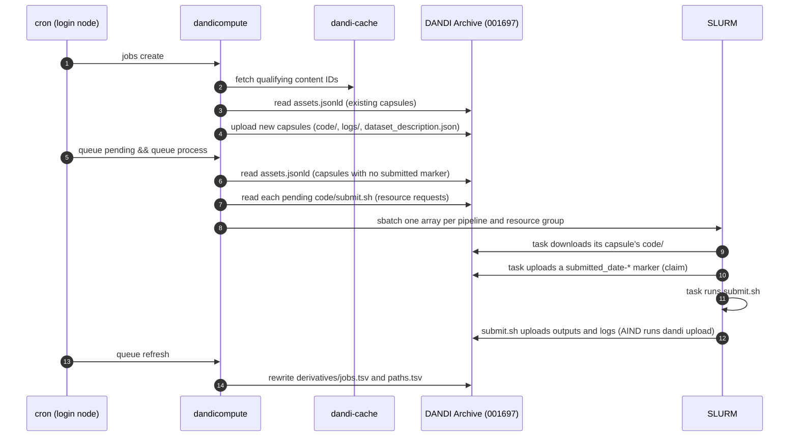

# Overview

DANDI Compute runs processing pipelines over assets that already live on the DANDI Archive, and uploads the results back to the archive. This repository is its core. It decides which assets need work, packages each unit of work, hands it to the cluster, and reports on how it went.

It does not contain the heavy science itself. The spike sorting comes from the separately versioned AIND ephys pipeline. The LFP extraction does ship here, but runs inside its own container.

## The big picture

A few properties fall out of this design.

- **The archive is the database.** There is no local queue file or state directory. The queue is rebuilt on every command from the job capsules Dandiset's `assets.jsonld`.
- **Each capsule describes itself.** A capsule carries its own submission script, parameter file and provenance. It can be run, inspected or re-run without this package having to remember anything about it.
- **SLURM enforces concurrency.** One array job per pipeline owns every run of that pipeline. Its `%n` throttle is the concurrency limit. See [Array dispatch](dispatch.md).

## Pipelines

| Pipeline | Key | What it does | Where its code lives | Runtime |
|---|---|---|---|---|
| AIND ephys | `aind+ephys` | Spike sorting, postprocessing, quality control and visualization of extracellular electrophysiology | [`aind-ephys-pipeline`](https://github.com/CodyCBakerPhD/aind-ephys-pipeline), checked out under the base directory | Nextflow driving Apptainer containers |
| LFP | `lfp` | Filtering, re-referencing and resampling of raw ephys into an LFP series | `src/dandi_compute_code/lfp_pipeline/` | The `dandi-compute-lfp` container via `datalad containers-run` |

Pipelines are listed in `src/dandi_compute_code/queue/pipeline_configs.json`, along with which parameter sets each one forms capsules for.

## The Dandisets involved

| Dandiset | Role |
|---|---|
| Any source Dandiset | Holds the raw NWB assets. It is never written to. |
| [`001697`](https://dandiarchive.org/dandiset/001697) | The job capsules Dandiset. Every capsule is uploaded here, along with the `jobs.tsv` and `paths.tsv` tables and the queue reports. |
| [`001873`](https://dandiarchive.org/dandiset/001873) | The failed runs archive. Capsules that failed, stalled or were abandoned are moved here with their path intact, which keeps `001697` clean. |

## The main loop

Automated operation is a small number of commands run on a schedule.

## Glossary

Job capsule
: One unit of work, which is one pipeline run over one asset with one parameter set. It is a directory in `001697` holding `code/`, `logs/`, `dataset_description.json` and, once it has run, its outputs. See [Job capsules](job_capsules.md).

Job ID
: The capsule directory's name, `job-{YYMMDD}{hash}`. The hash covers everything that identifies the job except the codebase version.

Content ID
: The DANDI identifier of an asset's content (its blob or Zarr ID). Assets are addressed by content ID so a job follows the data, not the path it was uploaded under.

Registry
: A packaged JSON file mapping a short key such as `default` to a parameter or config file and the MD5 that file must still have.

Dispatcher
: The single SLURM array job that runs all of one pipeline's pending capsules, named `dandicompute-dispatch-{pipeline}`.

Base directory
: The fixed working tree on the cluster every command is pointed at with `--base`. See [Infrastructure](infrastructure.md).
