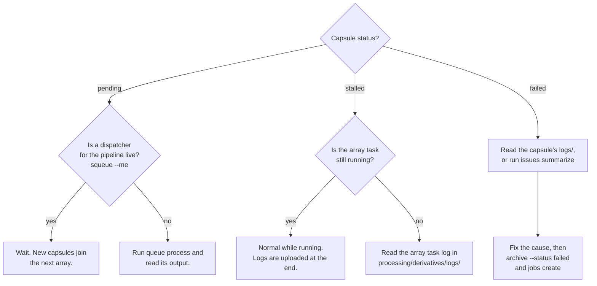

# Troubleshooting

Most problems show up as a capsule stuck at one status. Start from `jobs.tsv` in `001697`, which `dandicompute queue refresh` rebuilds, and find the capsule's row.



## Where to look

| What | Where |
|---|---|
| What the dispatcher submitted | `processing/derivatives/logs/dandicompute-dispatch-{pipeline}/{timestamp}-manifest-{n}.txt` and `-dispatch-{n}.sh` |
| What an array task did before the capsule ran | `processing/derivatives/logs/dandicompute-dispatch-{pipeline}/{timestamp}-dispatch-{n}-{job}_{task}.log` |
| The capsule's own run | Its `logs/job-{id}_slurm.log`, in the preparation tree while it runs and on the archive once uploaded |
| Nextflow detail (AIND) | `logs/nextflow.log`, `logs/timeline.html`, and the Nextflow work directory under `work/` |
| Resource usage (LFP) | `logs/duct_*` |
| Error lines across every capsule | `derivatives/issues_summary.json` in `001697`, from `dandicompute issues summarize` |

## Common problems

### "`DANDI_API_KEY` environment variable is not set"

The command writes to the archive and needs credentials. Export `DANDI_API_KEY` before running.

### `queue process` reports `dispatcher-active`

The pipeline already has an array on the cluster, which owns every pending capsule it was given. Nothing new is submitted until that array has finished. This is deliberate. Capsules formed since will go out with the next dispatch. See [Array dispatch](dispatch.md).

If the dispatcher itself is stuck, cancel it with `scancel --name dandicompute-dispatch-{pipeline}`. Capsules it had already claimed stay `stalled` and have to be archived or cleaned by hand. Unclaimed ones go out with the next dispatch.

### Capsules stay `pending` although nothing is dispatching

`queue process` reads pending capsules from the archive's `assets.jsonld` on S3. A capsule uploaded moments ago may not appear there yet. Wait and retry.

Also check that the capsule's pipeline is still listed in `pipeline_configs.json`. Capsules of an unconfigured pipeline are never dispatched.

### A capsule is `stalled` long after its array task ended

The task claimed the capsule but nothing was uploaded afterwards. Common causes are the task being killed at its time limit or preempted (LFP runs on `mit_preemptable`), a crash in `submit.sh` before its final upload, or the preparation tree having been removed. Read the array task log first, then the capsule's SLURM log in its preparation tree.

To retry, move the capsule out and form a new one:

```bash
dandicompute archive --status stalled
dandicompute jobs create
```

### Preparation fails with an MD5 mismatch

A parameter or config file was edited without updating its registry entry. Recompute the checksum with `md5sum` and update the `md5` in the matching `registries/*.json`. Editing a registered file changes the ID of every future capsule formed with it, which is intended.

### Preparation fails on the pipeline version

AIND parameter files declare the pipeline version they were written for. The requested version must be in the same major series and at least as new. `v1.0.0` itself is rejected, use `v1.0.0-fixes`.

### "Content ID ... not found in content ID to usage Dandiset path mapping"

The `dandi-cache/content-id-to-usage-dandiset-path` cache does not know the asset yet, usually because it was uploaded recently. `jobs create` skips such assets and picks them up once the cache catches up.

### `clean --dispatch` removes nothing

A dispatch directory is only removed when it is at least `--age` hours old (24 by default) and no dispatcher for its pipeline is live. Lower `--age` if needed. A live dispatcher always blocks removal.

### `processing/` keeps growing

Preparation trees (`prepare-job-*`) are never removed automatically, because capsules run inside them. Remove a tree only once its capsule has run and been uploaded. `processing/done.txt` lists the trees whose script ran to completion. Temporary trees from other commands are left behind only when a step failed or `--test` was given.
