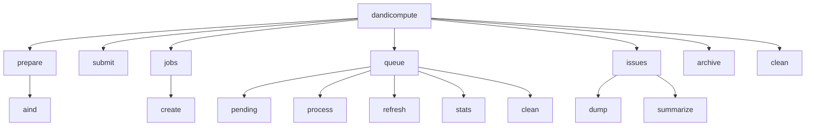

# Usage

## Installation

The orchestration side is a light install. It needs Python 3.10 or newer.

```bash
pip install git+https://github.com/dandi-compute/dandi-compute-core
```

On the cluster the package is installed from the `code/` checkout inside the base directory, so that the commit recorded in each capsule's provenance matches what is on disk:

```bash
cd /orcd/data/dandi/001/dandi-compute/code
git pull
pip install -e .
```

The LFP pipeline's scientific stack (SpikeInterface, neuroconv, pynwb) is not part of this install. It lives in the LFP container. To reproduce that environment locally, install both projects:

```bash
pip install . ./src/dandi_compute_code/lfp_pipeline/envs
```

For development, the `dev`, `docs` and `schemas` dependency groups are available, and `all` pulls in every one of them:

```bash
pip install -e . --group all
```

## Environment variables

| Variable | Needed by | Purpose |
|---|---|---|
| `DANDI_API_KEY` | Every command that writes to the archive | Authenticates uploads, deletions and moves on the DANDI Archive. |
| `DANDI_DEVEL` | `queue refresh`, `queue process`, `archive` | Enables the DANDI client's development options, which `dandi upload --allow-any-path` requires for the non-BIDS paths capsules use. |

A command that needs one of these and finds it unset exits with an error before touching anything.

## The command line

Everything is driven by the `dandicompute` command. Every command that reads or writes the cluster's working tree takes `--base`, which defaults to `/orcd/data/dandi/001/dandi-compute` (see [Infrastructure](infrastructure.md)). Most commands take `--silent` to suppress log output and `--test` to keep their temporary working trees on disk for debugging.



| Command | What it does | Writes to |
|---|---|---|
| `prepare aind` | Forms one AIND ephys capsule for one asset, optionally submitting it at once. | `001697` |
| `submit --script PATH` | Submits a prepared capsule's `submit.sh` directly with `sbatch`, bypassing the queue. | SLURM |
| `jobs create` | Forms a capsule for every qualifying asset and configured parameter set that does not have one yet. | `001697` |
| `queue pending` | Exits 0 when any capsule awaits submission and 1 when none does. | Nothing |
| `queue process` | Hands every pending capsule to its pipeline's SLURM array dispatcher. | SLURM, `processing/` |
| `queue refresh` | Rebuilds `derivatives/jobs.tsv` and `derivatives/paths.tsv` in both the capsules and archive Dandisets. | `001697`, `001873` |
| `queue stats` | Aggregates wall time per Nextflow step across all capsules into `derivatives/queue_stats.json`. | `001697` |
| `queue clean` | Deletes every capsule that was prepared but never claimed by a dispatcher. | `001697` |
| `issues dump` | Scans every capsule's Nextflow and SLURM logs for error lines into `derivatives/issues_dump.json`. | `001697` |
| `issues summarize` | Runs `issues dump`, then ranks the error lines by frequency into `derivatives/issues_summary.json`. | `001697` |
| `archive` | Moves one capsule (`--job`) or every capsule with a status (`--status`) to the failed runs archive. | `001697`, `001873` |
| `clean` | Empties `work/` (`--work`), removes finished dispatch directories (`--dispatch`), or both. | Base directory |

Run any command with `--help` for its full list of options.

## Common tasks

### Process one asset by hand

Useful when debugging a single asset. Assets are addressed by content ID, or by Dandiset and path.

```bash
export DANDI_API_KEY=...

# Form the capsule and print the command that would submit it
dandicompute prepare aind --id 048d1ee9-83b7-491f-8f02-1ca615b1d455 --version v1.2.4

# Or address the asset by where it lives
dandicompute prepare aind --dandiset 000409 --dandipath sub-mouse01/sub-mouse01_ecephys.nwb --version v1.2.4

# Pick a registered parameter set and cluster config, and submit straight away
dandicompute prepare aind --id <content id> --version v1.2.4 --params no-motion --config default --submit
```

If a capsule already exists for that asset, parameter set, config and pipeline version, nothing is formed and the command says so. A capsule is never formed twice. Forming test capsules for the example asset, across every configured pipeline and parameter set, is one flag:

```bash
dandicompute prepare aind --test
```

### Keep the queue full

`jobs create` crosses every pipeline and parameter set in `pipeline_configs.json` with that pipeline's qualifying assets. Assets that already have a capsule for the combination are skipped.

```bash
dandicompute jobs create                     # every configured pipeline
dandicompute jobs create --pipeline lfp      # one pipeline
dandicompute jobs create --limit 20          # at most 20 new capsules
```

`--limit` samples round-robin across Dandisets, so a small limit spreads work over many datasets rather than exhausting the first one.

`--latest` deliberately ignores existing capsules and forms a new one for every qualifying asset against the newest local pipeline version. It is how a new pipeline release is rolled out over assets that were already processed.

### Run the queue

```bash
dandicompute queue pending --silent && dandicompute queue process
```

`queue process` is safe to run repeatedly. A pipeline whose dispatcher is still on the cluster is skipped, so overlapping invocations never stack arrays. [Array dispatch](dispatch.md) explains the mechanism in full, including how array resources are sized.

```bash
dandicompute queue process --pipeline lfp --max 4   # one pipeline, overriding its limit
dandicompute queue process --jitter 0               # no random start delay
```

### Report on the queue

```bash
dandicompute queue refresh      # jobs.tsv + paths.tsv in 001697 and 001873
dandicompute queue stats        # queue_stats.json
dandicompute issues summarize   # issues_dump.json + issues_summary.json
```

These publish into the Dandiset's `derivatives/` directory, so the state of the queue can be browsed from the archive without cluster access. Their formats are in [Data model](data_model.md).

### Clear out failures

```bash
dandicompute archive --status failed      # every capsule with logs but no output
dandicompute archive --status stalled     # claimed, but nothing was ever logged
dandicompute archive --job derivatives/dandisets-000/dandiset-000409/sub-mouse01/pipeline-aind+ephys/job-260916a1b2c3
```

Archiving preserves each capsule's path exactly and deletes it from the source only after the upload to the archive succeeds. Once a failed capsule is archived, the next `jobs create` sees no capsule for that asset and forms a fresh one.

To throw away capsules that were never claimed, for example after changing a parameter set, delete them instead of archiving:

```bash
dandicompute queue clean
```

### Tidy the cluster

```bash
dandicompute clean --work              # empty work/ except its apptainer_cache/
dandicompute clean --dispatch          # remove dispatch directories with no live array
dandicompute clean --dispatch --age 6  # only those at least 6 hours old
```

## Running on a schedule

In production these run from `cron` on a login node. The schedule below is an example of how the commands fit together, not a copy of the live crontab.

```text
# m    h  dom mon dow  command
*/15   *  *   *   *    dandicompute queue pending --silent && dandicompute queue process --silent
0      */6 *  *   *    dandicompute jobs create --limit 50 --silent
30     *  *   *   *    dandicompute queue refresh --silent
0      3  *   *   *    dandicompute queue stats --silent && dandicompute issues summarize --silent
0      4  *   *   *    dandicompute clean --dispatch --silent
```

`cron` does not read a login shell's profile, so the `DANDI_API_KEY` and `DANDI_DEVEL` variables and the environment holding `dandicompute` have to be set up in the crontab itself or in a wrapper script.

## Using the Python API

Every command is a thin wrapper around the public API, so the same operations are available from Python.

```python
import dandi_compute_code.queue as queue

state = queue.PipelineQueue.from_dandi()      # the live queue, rebuilt from 001697
print(len(state), "capsules")
for capsule in state.failed:
    print(capsule.job.job_id, capsule.job.within_dandiset_path)

queue.PipelineQueue.has_pending_jobs()       # same check as `queue pending`
```

See the [API reference](api/index.rst) for every public function and class.
